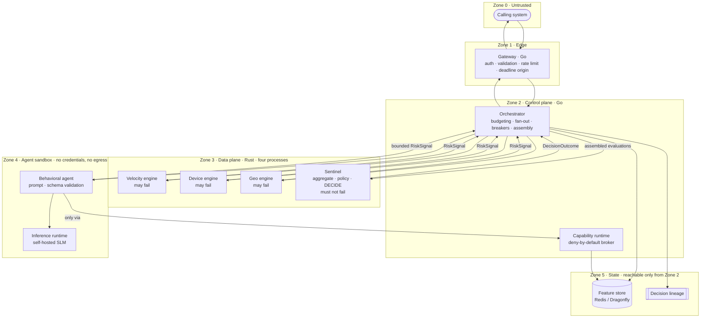

# Architecture

Status: Phase 1. The deterministic decision path described here is implemented
and exercised end to end. Where behaviour does not exist yet, it says so; §9
lists what remains.

## 1. What Legion is

Legion is a real-time risk decisioning platform for payment authorisation. It
receives a transaction, gathers evidence about it, asks a small number of
narrow agents for bounded opinions, and applies deterministic policy to those
opinions to produce one of three outcomes: `ALLOW`, `REVIEW` or `DECLINE`.

The organising principle is a separation of authority:

> AI produces bounded risk signals. Deterministic software owns the final
> financial decision.

Everything else in this document follows from that sentence and from the
consequences of a hard request deadline.

## 2. Language responsibilities

Legion uses two languages, each for one reason.

**Go orchestrates.** The gateway and the orchestrator own the control plane:
transport, authentication, validation, deadline propagation, fan-out and
fan-in, circuit breaking, rate limiting, retries, health, configuration,
background work and graceful shutdown. This is I/O-bound, concurrency-heavy
work with a lot of policy about *when* things happen. Go's scheduler,
`context` propagation and operational ecosystem fit it well. See ADR-001.

**Rust computes.** The deterministic agents and the sentinel own the data
plane: feature transformation, rule evaluation, normalisation, weighted
aggregation and policy application. This is CPU-bound work under a tight tail
latency budget where allocation behaviour and the absence of a garbage
collector matter, and where the correctness of arithmetic must be enforced by
the type system. See ADR-002.

The boundary is not "Rust because it is fast". It is: *anything that decides
how much money is at risk is computed in Rust, under types that make an
invalid score unrepresentable; anything that decides what work to do and when
to stop waiting is Go.*

There is no C#, Java, Node.js or Python service in Legion. Python is permitted
for model experimentation, evaluation tooling and notebooks, and must never
appear on the synchronous transaction path.

## 3. Component map



Every signal returns to the orchestrator before the sentinel is called. The
engines do not call the sentinel, the behavioural agent does not call the
sentinel, and the sentinel writes nothing: it is a pure function of its request
(§4), and Zone 2 is the only zone permitted to reach Zone 5. Lineage is
therefore written by the orchestrator.

| Component | Language | Owns | Explicitly does not own |
|---|---|---|---|
| Gateway | Go | Transport, authn/authz, request validation, rate limiting, deadline origin | Any risk logic |
| Orchestrator | Go | Budget allocation, feature fetch, fan-out/fan-in, breakers, degradation state | Score to decision mapping, per-agent code paths (ADR-014) |
| Velocity / Device / Geo engines | Rust | Deterministic signals from supplied features | I/O, decisions |
| Sentinel | Rust | Normalisation, weighting, aggregation, policy, **the decision** | I/O of any kind |
| Capability runtime | Go | Brokering every action an agent may take | Producing signals |
| Behavioral agent | Go + SLM | Prompt construction, structured output validation, bounded signal | Decisions, unvalidated output |
| Feature store | Redis / Dragonfly | Low-latency windowed aggregates | Truth of record |

## 4. Request flow

```text
Transaction
    │
    ▼
Go Gateway ─────── authenticate, validate, establish 80 ms deadline
    │
    ▼
Go Orchestrator ── allocate stage budgets, fetch features
    │
    ├──► Rust Velocity ┐
    ├──► Rust Device   ├── parallel, deterministic, ~sub-millisecond
    ├──► Rust Geo      ┘
    │
    └──► Behavioral SLM Agent ── bounded, capability-scoped, validated output
    │
    ▼
Rust Sentinel ──── normalise → weight → aggregate → apply policy
    │
    ▼
ALLOW / REVIEW / DECLINE  +  reason codes  +  decision lineage
```

Two properties of this flow are load bearing:

1. **The sentinel is a pure function of its request.** It performs no I/O. Its
   inputs are the subject, the agent evaluations and the policy version. This
   is what makes replay meaningful (ADR-013).
2. **Signals flow one way.** No agent sees another agent's output, and no agent
   sees the decision. There is no feedback path an agent could use to steer the
   outcome beyond its own weighted contribution.

## 5. Deployment shape

The four Rust components are separate crates, separate gRPC contracts and
separate processes: the velocity, device and geo engines, and the sentinel.

The split follows the failure model rather than the org chart. An engine may
fail — its signal is excluded and the remaining weights renormalised — while the
sentinel may not fail at all, and under `panic = "abort"` those two properties
cannot share a process. The engines are separated from each other for the same
reason at one remove: the faults that kill a process are per-engine, so
co-locating them would turn three survivable degradations into one correlated
failure. The cost is operational surface, not latency: the orchestrator already
issued these as separate calls, and the three engine calls run in parallel
inside one shared window. See ADR-006.

The gateway, the orchestrator, each of the three engines, the sentinel and the
inference runtime are separate deployables because they differ materially in
resource profile, blast radius or trust level. Nothing else is a separate
service yet.

## 6. Contracts

Protocol Buffers over gRPC are the authoritative service-to-service contracts
(ADR-003). There is no hand-written parallel JSON contract for internal
services.

| Package | Contents |
|---|---|
| `legion.common.v1` | `Money`, `PseudonymousId`, `Version`, `Failure` |
| `legion.risk.v1` | `Transaction` and its parts, `Feature`, `RiskSignal`, `AgentEvaluation`, `Decision`, `DecisionOutcome`, `ReasonCode`, `DecisionLineage` |
| `legion.agent.v1` | `Capability`, `AgentManifest`, `CapabilityAudit`, `AgentService`, `CapabilityService` |
| `legion.dataplane.v1` | `SentinelService` |
| `legion.gateway.v1` | `DecisionService` |

Structured JSON with a JSON Schema is used in exactly one place: the interface
between the behavioural agent and the language model. That is a *model output
constraint*, not a transport, and it is validated before anything it contains
enters the deterministic pipeline.

The gateway and the orchestrator both implement `DecisionService`. The gateway
is a policy-enforcing front for the same operation, so giving it a second,
near-identical contract would only create something to drift.

## 7. Cross-cutting models

Each of these has its own document because each is a place where systems of
this kind usually go wrong quietly:

- [Domain model](domain-model.md) — terminology and the risk-subject abstraction
- [Decision model](decision-model.md) — scoring, weighting, policy, lineage
- [Deadline model](deadline-model.md) — how 80 ms is divided and enforced
- [Failure model](failure-model.md) — what happens when a dependency does not answer
- [Capability model](capability-model.md) — what an agent is allowed to do
- [Security boundaries](security-boundaries.md) — trust zones and data handling
- [Threat model](threat-model.md) — threats, mitigations, residual risk

## 8. Repository layout

The top level separates deployables from everything else. A zone directory
holds services and nothing but services; shared libraries live outside the
zones, because a library belongs to no trust boundary.

```text
legion/
├── gateway/              Zone 1 · Go · edge service
├── control-plane/        Zone 2 · Go
│   └── orchestrator/
├── data-plane/           Zone 3 · Rust · four processes
│   ├── sentinel/         aggregation, policy, decision authority
│   └── engines/
│       ├── velocity/
│       ├── device/
│       └── geo/
├── crates/               Rust · shared libraries, no deployables
│   ├── common/           value types with enforced invariants
│   ├── platform/         config and process lifecycle
│   └── proto/            generated bindings (built by cargo, not committed)
├── internal/platform/    Go · config and process lifecycle
├── protocol/
│   ├── protobuf/         authoritative .proto contracts
│   └── gen/go/           generated bindings (committed; CI verifies)
├── docs/
│   └── adr/              architecture decision records
├── Cargo.toml            Rust workspace root
├── go.mod
├── buf.yaml, buf.gen.yaml
└── Makefile
```

Five conventions hold this together.

**Zones are directories; deployables are their children.** `gateway/` is the
exception and stays at the root, because Zone 1 contains exactly one component
and always will. A directory with one permanent child is ceremony.

**Libraries live outside the zones.** `crates/` holds code that is shared and
deploys nowhere. Keeping it inside `data-plane/` would have made every consumer
appear to depend on the data plane — including the Phase 7 benchmarks, and
including the gateway, whose contract `crates/proto` also generates. `internal/`
is the Go equivalent, and stays where the Go compiler requires it.

**The engine/sentinel split is structural.** `sentinel/` sits outside
`engines/` so that the may-fail / must-not-fail boundary of ADR-006 is visible
in the tree rather than only in prose.

**Component-private code lives under `<component>/internal/`** (ADR-015), which
makes a cross-component import of private code a compile error. Code reaches
`internal/platform/` only once a second consumer exists.

**One Rust workspace, rooted at the repository root.** It currently contains
only data plane crates, but Phase 7 compares equivalent Go and Rust
implementations, and those crates are not data plane. Rooting the workspace here
keeps one lockfile and — more importantly — one definition of the lint policy
that forbids `unsafe` and denies `unwrap` on the decision path.

Zone 4 will be `agents/`, holding the behavioural agent and the inference
runtime. Directories from the long-term plan that have no implementation purpose
yet are deliberately absent. Empty directories that promise work are worse than
no directories.

Directories from the long-term plan that have no implementation purpose yet —
`inference/`, `feature-store/`, `simulator/`, `replay/`, `evaluation/`,
`benchmarks/`, `policy/`, `model-registry/`, `observability/`,
`infrastructure/`, `security/` — are deliberately absent. Empty directories
that promise work are worse than no directories.

## 9. What is not built

The deterministic path is complete: the gateway, the orchestrator, the three
engines and the sentinel all run, and a transaction presented at the edge
returns a decision.

The following exist only as documented intent: the inference runtime, the
behavioural agent, the capability runtime implementation, Kubernetes manifests,
the fraud simulator, the replay engine, the evaluation framework and all
benchmarks.

Three gaps inside the parts that do exist are worth naming, because each is
easy to mistake for working:

- **Nothing writes features.** The orchestrator reads the store; no ingest path
  populates it, so a deployed store stays empty and every evaluation sees
  absence rather than history.
- **There is no local cache tier.** ADR-007 calls for one with an explicit
  staleness window; without it a store outage degrades every evaluation at once.
- **Transport is not secured.** Services speak plaintext gRPC between
  themselves, and callers authenticate with shared keys. mTLS and workload
  identity are Phase 4 (ADR-011).

No latency, throughput or detection-quality claim in this repository is
currently supported by measurement, and none is made.
